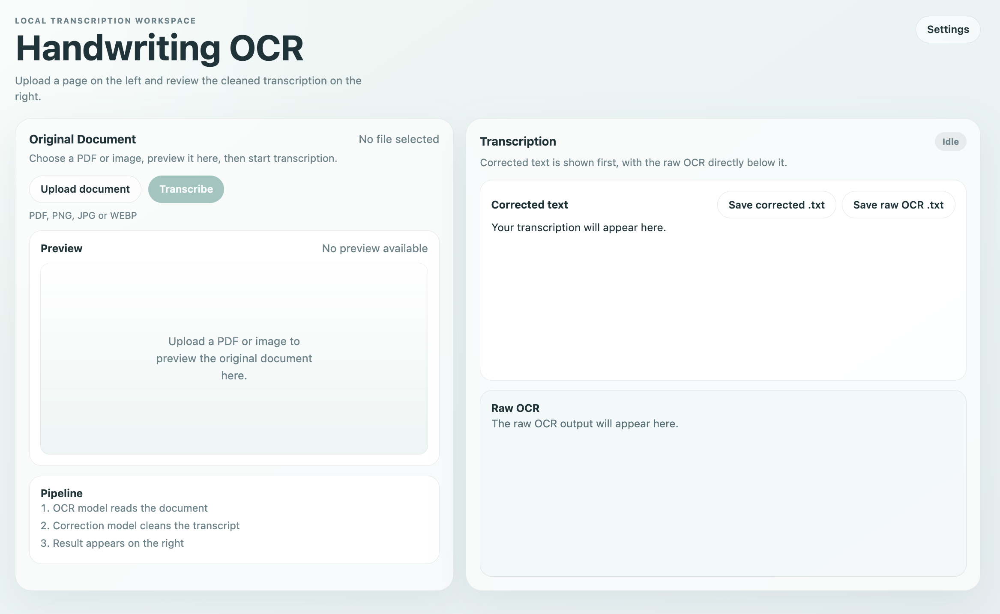

# Handwriting OCR

A local transcription app for handwritten documents, especially historical German scripts such as Suetterlin / Sütterlin.



You can run it in two ways:

- Browser mode: starts a local server and opens the default browser
- Desktop mode: runs as a packaged Electron app on macOS or Windows

The transcription flow is a two-step pipeline:

1. OCR / handwriting transcription model
2. Correction model

The first implementation starts with OpenRouter for model access and stores settings locally on the machine.

## Features

- Local server that opens the default browser automatically
- Electron desktop app for macOS and Windows
- Split-pane UI for upload and transcription
- Original document preview for images and PDFs
- Save corrected transcription and raw OCR as `.txt`
- Settings for OCR model, correction model, and provider API keys
- OpenRouter-backed OCR and correction pipeline
- Local JSON settings persistence

## Requirements

- Node.js 18+

## Install

1. Install Node.js 18 or newer from [nodejs.org](https://nodejs.org/).
2. Download or clone this repository.
3. Open a terminal in the project folder.
4. Install dependencies:

```bash
npm install
```

5. Start the browser app:

```bash
npm start
```

6. Open the localhost URL shown in the terminal.
   If port `3000` is already in use, the app automatically falls back to the next free port.

7. Open `Settings`, add your OpenRouter API key, load models, and choose:
   - one vision-capable OCR model
   - one correction model

8. Upload a handwritten page and click `Transcribe`.

## Install Desktop App

To run the desktop app directly on your own computer:

```bash
npm run desktop
```

This opens the app in an Electron window instead of a web browser.

## Make a Windows Installer on a Mac

If you want to give the app to someone on Windows, follow these steps exactly:

1. Open `Terminal` on your Mac.
2. Go to the project folder.
3. Install dependencies if you have not already done so:

```bash
npm install
```

4. Build the Windows installer:

```bash
npm run dist -- --win
```

5. Wait until the build finishes. This can take a little while.
6. Open the `dist` folder inside this project.
7. Look for a Windows installer file ending in `.exe`.

That `.exe` file is the Windows installer you can send to a Windows computer.

If you want only the normal Windows installer, use:

```bash
npm run dist -- --win nsis
```

If you want a portable Windows app instead, use:

```bash
npm run dist -- --win portable
```

What you will usually find in the `dist` folder:

- a Windows installer file ending in `.exe`
- sometimes also a `.zip` file

Important:

- You can build the Windows installer on a Mac.
- The Windows installer will not run on the Mac. It is only for Windows.
- If the build stops with an error, run `npm install` again and try again.
- The first build can be slower because Electron may need to download build files.

## Development

Run the browser version:

```bash
npm start
```

The app starts on `http://127.0.0.1:3000` by default and opens your browser automatically. If that port is busy, it uses the next available localhost port.

Run the desktop version:

```bash
npm run desktop
```

This launches an Electron window instead of opening the system browser.

## Packaging

Create an unpacked desktop build:

```bash
npm run pack
```

Create installable distributables:

```bash
npm run dist
```

Typical outputs:

- macOS: `.dmg` and `.zip`
- Windows: `NSIS` installer and `.zip`

Notes:

- Build macOS artifacts on macOS
- Windows installers can also be built on macOS with `npm run dist -- --win`
- App settings are stored in the local app data directory in desktop mode and in `data/settings.json` in browser mode

## Notes

- This version sends the uploaded file directly to a vision-capable model through OpenRouter when the OCR step uses the `openrouter` provider.
- The correction step is a second LLM call that cleans up the OCR output with a focus on historical German handwriting such as Suetterlin / Sütterlin.
- Azure Document Intelligence and Google Document AI are included as future provider targets in the settings schema, but they are not implemented in this first pass.

## Suggested Defaults

- OCR model: a high-end vision-capable OpenRouter model such as `google/gemini-2.5-flash-preview`
- Correction model: `openai/gpt-5-mini`

Use whatever model IDs are currently available in your OpenRouter account.
